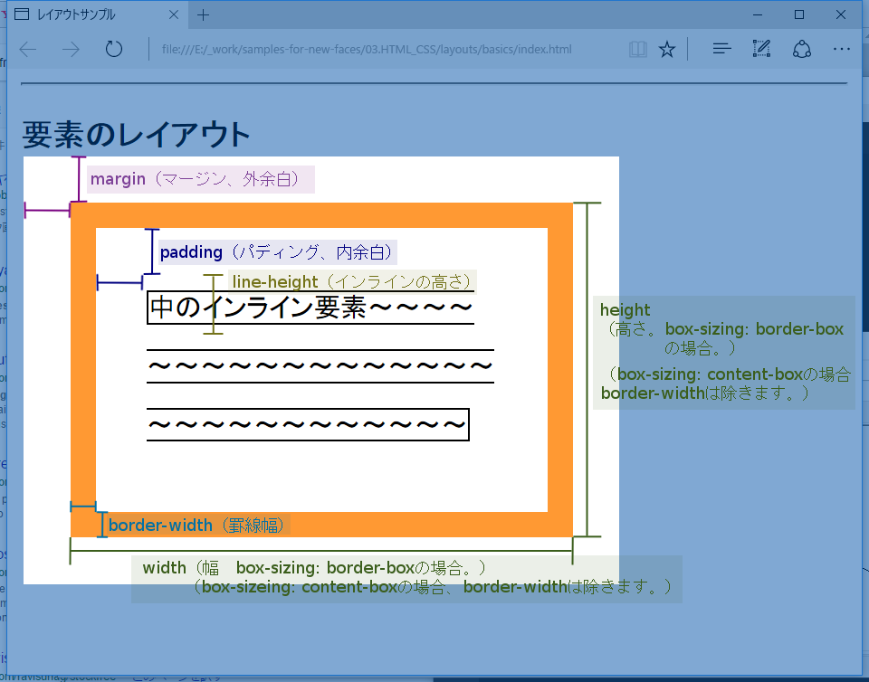

## ブロック要素、インライン要素について

ブロック要素、インライン要素の特性を理解することは、Webデザインの第一歩です。

以下にまとめました。

* [CodePenで作ったサンプルソース - https://codepen.io/pauyuya/pen/WpKJKo](https://codepen.io/pauyuya/pen/WpKJKo)

要約すると

* ブロック要素は、その名の通り横幅いっぱいのブロックを取ろうとする要素です。
  * div、p、formなどがあります。
  * 1行1ブロックです。（※CSSでこの法則をぶっこわすことができますが、基礎として覚えてください。）
  * ブロック要素の中にブロック要素を入れたりして、レイアウトを入れ子にしていきます。
* インライン要素は、作文用紙の文字の並び（ライン）のように、行内にずらーっと並ぼうとする要素です。
  * 文字、テキストボックス（コントロール）、画像、あとは<a>などの装飾タグなどがあります。
  * 外側のレイアウトにぶつかると、次の行にいったりｷﾞｭｯとつまります。

### 余白と高さ

（コード執筆中）
要約すると

* ブロック要素
  * 横幅いっぱいに広がってブロックを確保する要素
  * 原則、1行に1ブロック。（※ただし、CSSでこの原則をぶちこわすことができます）
  * div、p、formタグなどが該当します。
* インライン要素
  * 作文の行（ライン）に従って並ぶような要素。
  * 文字、br、画像、テキストボックスなどのコントロールなど。
  * レイアウトには使えません。

## サイズの基礎

解説図



この図は、以下のCSSプロパティを指定しています。

```
.c-box {
    /** border-widthも height、widthの中に含める。 */
    box-sizing: border-box;

    width : 300px;
    height : 200px;

    padding : 30px;
    border : solid 15px #f93;
    margin : 30px;

    line-height : 35px;
}
```

レイアウトについて、指定されたもの以外はデフォルト値（5pxほどの余白か、自動計算）が適応されます。

上記の例ですと、以下の式が満たされるように計算されます。

```
width = 左border + 左padding + 真ん中の領域の幅 + 右padding + 右border
height = 上border + 上padding + 真ん中の領域の高さ + 下padding + 下border
```
